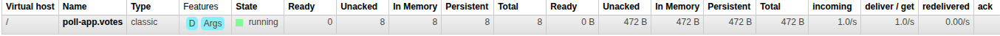

RabbitMQ installation: 
- Installed **Erlang** and **rabbitmq-server** via DNF, enabled service with **systemd**.
- Verified with **rabbitmq-diagnostics ping**
- Enabled management plugin: **rabbitmq-plugins enable rabbitmq_management** (UI on :15672, guest/guest).

Implementations:
- Topic exchange **polls**. Per-poll routing key: **poll.{pollId}.vote**.
- Queue **poll-app.votes**. App subscribes to all polls:
  - wildcard binding **poll.*.vote**
  - on poll creation, declares binding: **poll.{pollId}.vote**.
- REST votes publish a **VoteEvent** (using header: **source=poll-app**), listener consumes external vote events and applies them
- Anonymous voting implemented: **userId** is optional, backend path without dedupe and always increments the count for option.

Changes to handle anonymous voting:
- Frontend: updated the Poll component to allow voting without userID.
- created **castAnonymousVote** in PollManager, and made request parameter in VoteController optional, with changes.

Left to do:
- Yet to implement deleting of votes. Anyone can delete votes now for testing.
- Deleting a poll when RabbitMQ still has messages that are not consumed will, will lead to "desync" and exception "Option not found in poll" when in reality the Poll itself does not exist. Queue purge in RabbitMQ.

Testing:
- Start RabbitMQ (I ran it locally with management plugin enabled).
- Created user and a poll -> binding registers
- Voted via REST using frontend -> instant count update; producer published votes; listener consumed. Used a sleep delay to simulate a "job" and see unacked messages.

Example: Created a poll as a user, voted on different options, changed to anonymous (selected "--select--" in users dropdown) and spammed votes.
``` 
  AMQP recv poll=1 option=1 user=1 src=poll-app
  Removing vote 1 by user 1 on option 1
  AMQP recv poll=1 option=2 user=1 src=poll-app
  Removing vote 2 by user 1 on option 2
  Removing vote 3 by user 1 on option 1
  Removing vote 4 by user 1 on option 2
  AMQP recv poll=1 option=1 user=1 src=poll-app
  Removing vote 5 by user 1 on option 1
  Removing vote 6 by user 1 on option 2
  AMQP recv poll=1 option=2 user=1 src=poll-app
  AMQP recv poll=1 option=1 user=1 src=poll-app
  AMQP recv poll=1 option=2 user=1 src=poll-app
  AMQP recv poll=1 option=1 user=1 src=poll-app
  
  AMQP recv poll=1 option=1 user=null src=poll-app // anonymous votes from here 
  AMQP recv poll=1 option=2 user=null src=poll-app
    ...
  AMQP recv poll=1 option=1 user=null src=poll-app
  AMQP recv poll=1 option=1 user=null src=poll-app
```

In management: (I caught some unacked messages, which went down to zero as expected after a few seconds)
  

For standalone, I ran the StandaloneRabbitMQVoteProducer with args: 1 and 1. PollId: 1 and OptionID: 1, while running the application.
This created a new anonymous vote, which was notified below: (notice the src being **client** not **poll-app**)
```
    AMQP recv poll=1 option=1 user=null src=client
```
On refreshing the page the count was also updated in the frontend correctly.

Running the app:
the next step will be to dockerize the application, for now I am running:
- valkey-server (default port, use valkey-cli to FLUSHDB when needed)
- rabbitmq-server (runs with systemd, default port, enabled management, port 15672)
- Frontend: run [gradle](frontend/build.gradle.kts) tasks to build, and to copy over from dist.